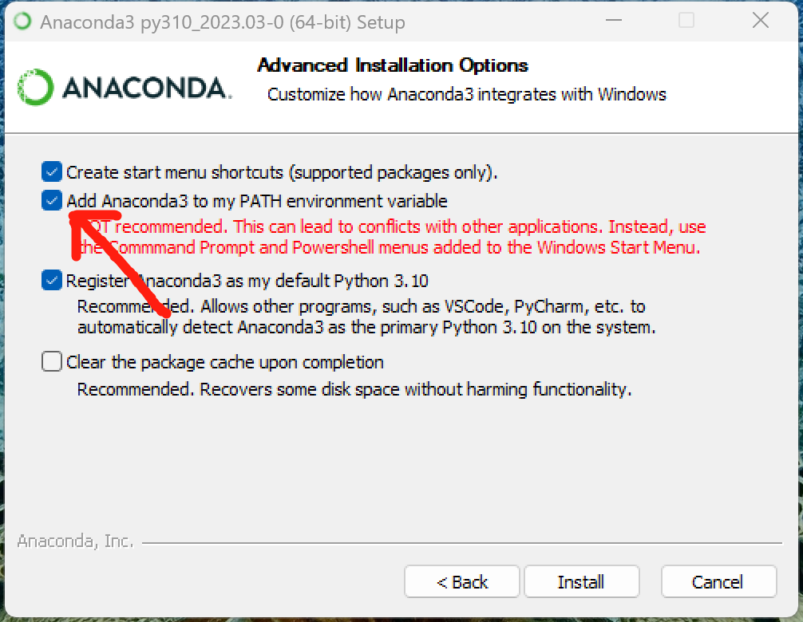

# archiv

日喀则电力公司文件归档小助手

## 主要功能

1. 自动添加档案章，档案号和序号
2. 自动添加卷内页码
3. 自动生成卷册封面，目录，备考表
4. 自动生成档案盒侧边贴条
5. 自动生成资料交接单

## 使用方式

1. 下载并安装[Anaconda3](https://mirrors.tuna.tsinghua.edu.cn/anaconda/archive/Anaconda3-2023.03-Windows-x86_64.exe)（ 安装时勾选下图选项），[Excle精灵](https://lestore.lenovo.com/detail/L105090)，[Office](https://www.microsoftstore.com.cn/software/office)

   

2. 下载本程序并解压（注意文件路径不含中文）：[archiv](https://gitee.com/Jainaul/archiv/repository/archive/main.zip)

3. 安装模块：双击文件夹内的``00_Install.bat``自动安装模块（输入"y"确认安装）

4. 将归档好的PDF文件放入``archiv``文件夹中，并按"档号__名字"的格式命名卷册名和文件名

```
目录结构如下：
├─archiv
   └─XXXXXX-XXXXXX-XX-XXXX-XXX__卷册名称1
   │   ├─XXXXXX-XXXXXX-XX-XXXX-XXX-XXX__文件名1.pdf
   │   ├─XXXXXX-XXXXXX-XX-XXXX-XXX-XXX__文件名2.pdf
   └─XXXXXX-XXXXXX-XX-XXXX-XXX__卷册名称2
       ├─XXXXXX-XXXXXX-XX-XXXX-XXX-XXX__文件名3.pdf
       ├─XXXXXX-XXXXXX-XX-XXXX-XXX-XXX__文件名4.pdf
```

2. 按需运行``01_添加档号章.bat``，``02_生成VBA表格.bat``，``03_VBA生成文档.bat``即可，输出文件在``output``文件夹中

> 01_添加档号章.bat：自动为PDF文件添加档号章和页码
>
> 02_生成VBA表格.bat：自动生成用于VBA的表格，可使用相应的软件手动Excle转Word
>
> 03_VBA生成文档.bat：用于自动将02中生成的VBA的表格，转化为Word